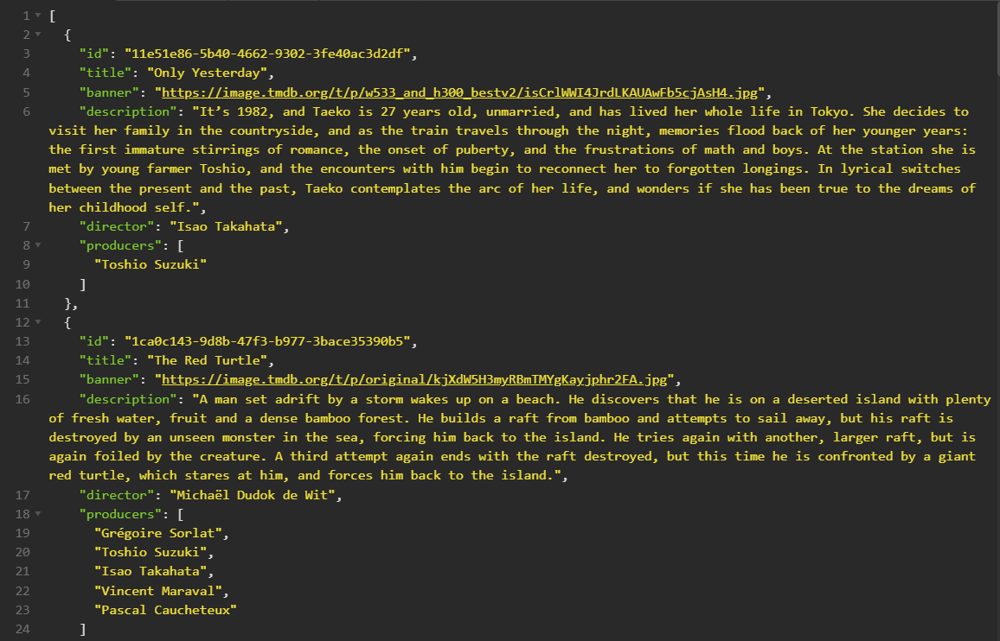

### Get All
This route is used to get all the 22 animations films from Studio Ghibli:

```js
'http://localhost:3000/movies'
```


*The first ones should be like the above image.*


*If all goes well, you should receive this status*

:::note

Since the backend is not yet deployed, note that your localhost is need to test all routes.

:::

### Get Page 1
This route is used to get the first pagination of 10 films from Studio Ghibli:

```js
'http://localhost:3000/movies/first'
```

### Get Page 2
This route is used to get the second pagination of 10 films from Studio Ghibli:

```js
'http://localhost:3000/movies/second'
```

### Get Page 3
This route is used to get the last pagination of films from Studio Ghibli:

```js
'http://localhost:3000/movies/third'
```