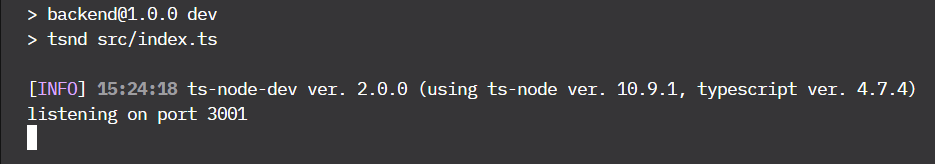

### Getting Started

First of all, create an empty folder and clone the following repository in order to access the databse:

```js
git clone 'https://github.com/calopessoa/studio-ghibli-heroku-backend'.
```

:::info

Don't forget to put '.' after the copied address, otherwise, just go to the created folder, using: "cd studio-ghibli-heroku-backend"

:::

Install dependencies
```js
npm install
```

### Running Up

Now run development server

```js
npm run dev
```
You should get this response:


